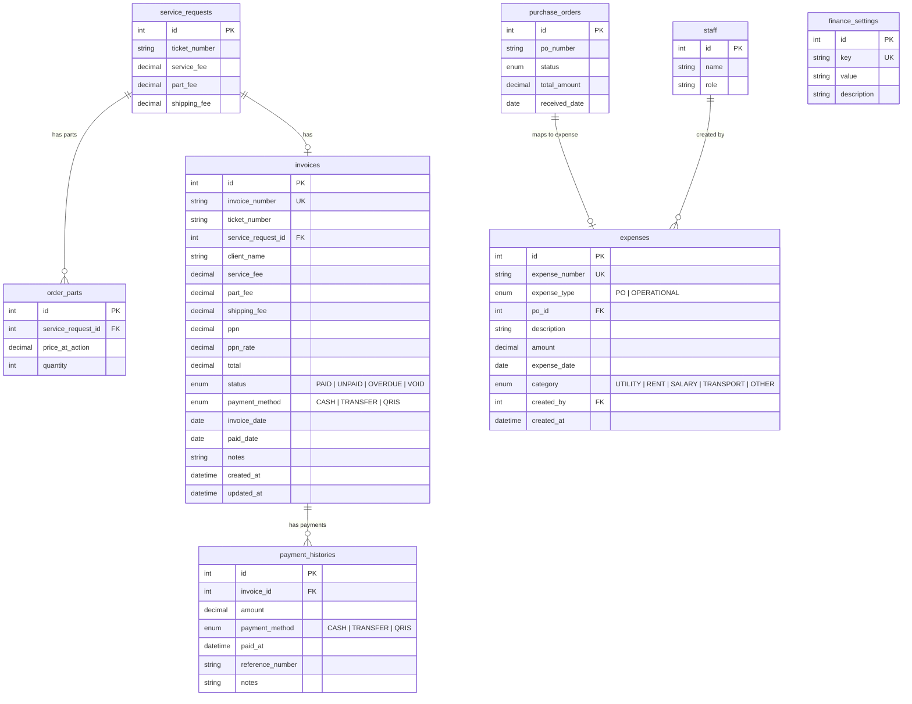

# Finance Module — Feature Integration Blueprint

## 1. Ringkasan Fitur & Batasan

### Tujuan Utama
Menyediakan sistem finansial yang terintegrasi penuh untuk bisnis servis: invoicing, expense tracking, laporan laba/rugi, dan dashboard finansial.

### Batasan (Scope Creep Prevention)
- BUKAN sistem double-entry accounting penuh
- BUKAN integrasi perbankan/API payment gateway
- BUKAN multi-mata uang
- BUKAN automated invoice reminders (email/WA)
- Expense dari PO hanya otomatis saat status PO = `RECEIVED`

---

## 2. Integrasi Data Model

### Entity Relationship Diagram



### Fields Added to Existing Tables

**`invoices`** (enhanced):
- `ppn_rate decimal(5,2)` — snapshot PPN rate saat invoice dibuat
- `status` → tambah enum `VOID`
- `payment_method` → diubah ke enum `CASH | TRANSFER | QRIS`
- `voided_at timestamp` — nullable

### New Tables Detail

**`payment_histories`** — mendukung partial payment di masa depan:
- `invoice_id` → FK ke `invoices.id`
- `amount` — jumlah yang dibayar
- `payment_method` — enum CASH/TRANSFER/QRIS
- `paid_at` — timestamp
- `reference_number` — nomor referensi (opsional)
- `notes` — catatan

**`expenses`** — dua tipe: PO otomatis & operational manual:
- `expense_number` — auto-generated: `EXP-YYYYMM-XXXX`
- `expense_type` — enum `PO | OPERATIONAL`
- `po_id` → FK ke `purchase_orders.id` (nullable, hanya untuk PO type)
- `description` — deskripsi pengeluaran
- `amount` — nominal
- `expense_date` — tanggal transaksi
- `category` — enum `UTILITY | RENT | SALARY | TRANSPORT | OTHER`
- `created_by` → FK ke `staff.id`

**`finance_settings`** — key-value config:
- `key` — unique identifier
- `value` — string value
- Default seeds: `{ key: "ppn_rate", value: "11" }`, `{ key: "invoice_prefix", value: "INV" }`

---

## 3. Defect & Risk Analysis

### 3.1 Race Condition — Duplicate Invoice per Ticket
- **Problem:** Double-click on "Generate Invoice" creates 2 invoices for same ticket.
- **Mitigasi:** Unique constraint `(ticket_number)` where status != `VOID`. Backend check + DB-level unique index.

### 3.2 PPN Rate Change Mid-Period
- **Problem:** Admin changes PPN rate. Old invoices recalculate incorrectly.
- **Mitigasi:** Snapshot `ppn_rate` di setiap invoice row. Rate dari `finance_settings` hanya untuk invoice baru.

### 3.3 Double Payment on Paid Invoice
- **Problem:** `markAsPaid` called twice → revenue inflated.
- **Mitigasi:** Backend: `if (invoice.status === 'PAID') throw BadRequestException`. Frontend: disable Pay button.

### 3.4 Expense Double-Counting from PO
- **Problem:** PO status toggles RECEIVED → PENDING → RECEIVED → expense created twice.
- **Mitigasi:** `expenses.po_id` unique constraint. Only generate on transition TO `RECEIVED`. Use `INSERT ... ON DUPLICATE KEY`.

### 3.5 Invoice Number Collision
- **Problem:** Random 4-digit suffix can collide.
- **Mitigasi:** Sequential per-bulan: `{prefix}-{YYYYMM}-{XXXX}` with atomic counter in `finance_settings`.

### 3.6 Invalid PPN Rate
- **Problem:** Admin sets rate to -5 or 200%.
- **Mitigasi:** Backend validation `@Min(0) @Max(100)`. Frontend input step 0.25.

---

## 4. Backend API Design

### Enhanced Endpoints (`FinanceController`)

| Method | Endpoint | Description |
|--------|----------|-------------|
| `GET` | `/finance/invoices` | List (search, status, date range) |
| `GET` | `/finance/invoices/:id` | Detail + payment history |
| `POST` | `/finance/invoices` | Create manual invoice |
| `PATCH` | `/finance/invoices/:id/pay` | Record payment |
| `PATCH` | `/finance/invoices/:id/void` | Void invoice |
| `POST` | `/finance/invoices/from-sr/:ticket` | Generate from SR |
| `GET` | `/finance/invoices/:id/export/pdf` | Export single PDF |
| `GET` | `/finance/invoices/:id/export/xlsx` | Export single XLSX |

### New Endpoints

| Method | Endpoint | Controller |
|--------|----------|------------|
| `GET` | `/finance/expenses` | `ExpenseController` |
| `POST` | `/finance/expenses` | Create operational |
| `PATCH` | `/finance/expenses/:id` | Update |
| `DELETE` | `/finance/expenses/:id` | Delete |
| `POST` | `/finance/expenses/sync-po` | Sync from RECEIVED POs |
| `GET` | `/finance/reports/profit-loss` | P&L by period |
| `GET` | `/finance/reports/tax/ppn` | PPN recap |
| `GET` | `/finance/dashboard` | Revenue vs Expense data |
| `GET` | `/finance/settings` | Get config |
| `PATCH` | `/finance/settings` | Update config |

### Service Layer

```
FinanceModule
├── FinanceService       — invoice CRUD, payment, export
├── ExpenseService       — expense CRUD, PO sync
├── ReportService        — P&L, PPN, dashboard
└── FinanceSettingsService — key-value config
```

---

## 5. Frontend Architecture

### Route Structure

```
/finance              → default → Invoice list (enhanced)
├── /finance/expenses → Expense CRUD page
├── /finance/reports  → P&L + PPN reports
└── /finance/settings → PPN rate, invoice prefix
```

### Component Tree

```
src/features/finance/
├── page.tsx                    # Enhanced invoice list + summary cards
├── api/finance-api.ts          # All API calls
├── types/index.ts              # All TypeScript interfaces
├── hooks/
│   ├── useFinance.ts           # Invoices + stats hooks (enhanced)
│   └── useExpenses.ts          # NEW: expense hooks
├── components/
│   ├── InvoiceTableRow.tsx     # Existing (enhanced)
│   ├── InvoiceDetailModal.tsx  # NEW: detail + payment history
│   ├── PaymentForm.tsx         # NEW: proses bayar
│   ├── ExpenseForm.tsx         # NEW: add/edit expense
│   ├── ExpenseTable.tsx        # NEW: expense list
│   └── SettingsForm.tsx        # NEW: config form
├── reports/
│   ├── ProfitLossChart.tsx     # NEW: bar chart revenue vs expense
│   ├── PpnReport.tsx           # NEW: PPN monthly table
│   └── ExportButton.tsx        # NEW: export dialog
└── expenses/
    └── page.tsx                # NEW: expenses page
```

### UI Design
- Dark blueprint theme (DESIGN.md)
- Summary cards: `TrendingUp` (revenue), `CreditCard` (outstanding), `AlertCircle` (overdue), `Wallet` (expenses)
- Tables with monospace font for financial values
- Charts via recharts (bar chart for revenue vs expense)

---

## 6. Fase Implementasi

### Phase 1: Database Schema
- Enhance `invoices.schema.ts` (paymentMethod enum, ppnRate, voidedAt)
- Create `payment_histories.schema.ts`
- Create `expenses.schema.ts`
- Create `finance_settings.schema.ts`
- Update `relations.ts` and `index.ts`
- **User:** run `npm run db:push`

### Phase 2: Backend API
- Enhance `FinanceService` (sequential numbering, PPN snapshot, void, multi-payment)
- Create `ExpenseService` + `ExpenseController`
- Create `ReportService` (P&L, PPN recap, dashboard)
- Create `FinanceSettingsService`
- Export PDF + XLSX

### Phase 3: Frontend UI
- Enhance finance page (detail modal, payment form)
- Expense page (CRUD, PO sync button)
- Reports page (P&L chart, PPN table)
- Settings page
- Export buttons

### Phase 4: Integrasi & Testing
- `POST /from-sr` → pay → stats update
- PO receive → expense auto-create → P&L reflects
- Edge cases: void, double-payment prevention
- Lint + type-check + build
